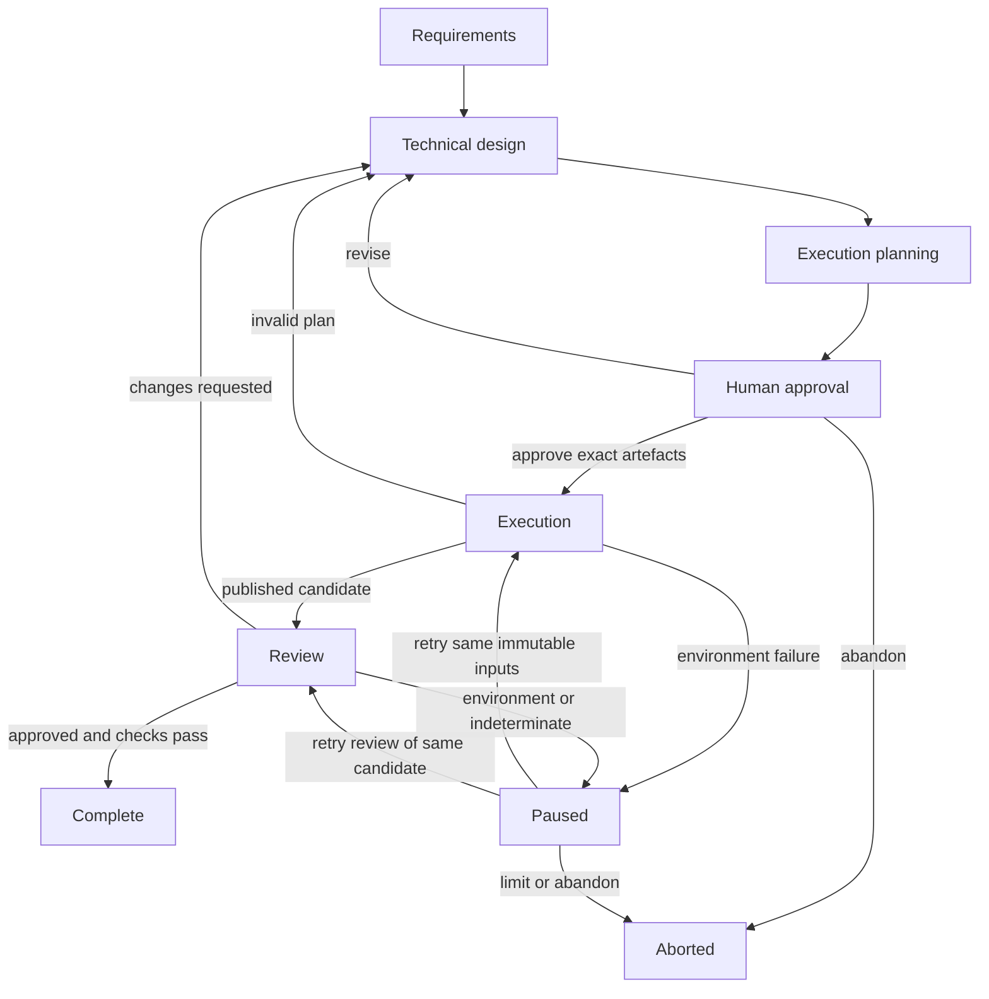
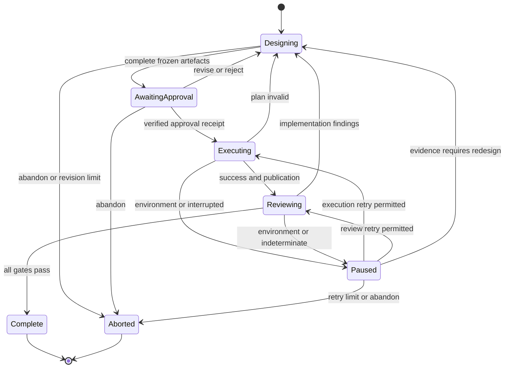

# Design–Execution–Review workflow (proposed v1)

Status: architectural foundation only; not installed or active. No agent, model,
OpenCode configuration, installer or existing review adapter changes in this PR.
The contracts in [schemas/](schemas/) are versioned independently of OpenCode and
review-cli. See [validation.md](validation.md) to run the examples and negative tests.

## Objectives and non-goals

Move engineering decisions and proposed code into collaborative Design. Human
participation is an explicit part of requirements, technical decisions and final
approval. Execution applies an approved patch deterministically; Review gathers
mechanical and independent semantic evidence without repairing code. All failures
carry structured feedback. A human can author or use any artefact independently.

This is not a replacement runtime, an autonomous implementation loop, a general
command runner, a roadmap system or an executor implementation. No changes to
Ordna or to the review repository are involved. Completion means verified output;
merging, deploying or updating the primary checkout are separate authorized actions.

## Evidence from the current repository

Inspected dotfiles main at `b9d7eb84cfa3e4d1e5c2a166febfa504638085f3`.
These are source observations, not assumptions about platform enforcement.

| Current component | Observed behaviour | Proposed boundary |
|---|---|---|
| [Design](../../agents/design.md) | Inline discovery (up to five key files), toolchain detection, short PRECOMPUTED_PLAN, human confirmation; no source edits | Three collaborative subphases; concrete code and tests represented as external patch artefacts |
| [Linear Orchestrator](../../agents/linear-orchestrator.md) | Performs design inline, marks started, delegates pipeline, marks completed on PASSED | Optional ticket adapter; immutable requirement snapshot; completion follows exact revision review |
| [Pipeline Runner](../../agents/pipeline-runner.md) | LLM coordinates Tester/Implementer, clean-tree baseline, formatter fixes, commands, criterion evidence, review and repair retries; edits model frontmatter for escalation | Replaced incrementally by state coordination, deterministic executor and non-mutating Review |
| [Tester](../../agents/tester.md), [Implementer](../../agents/implementer.md) | Generate tests/code after plan approval; implementation decisions remain downstream | No corresponding write-capable Execution agent; proposed tests/code belong to Design |
| [review_changes](../../tools/review_changes.ts), [adapter](../../scripts/review-runner.mjs) | Shell-free binary invocation; temporary requests outside repo; fixed base, optional committed head, snapshot and verdict validation | Reuse committed base/head and review.result/v1 mapping; add design and mechanical evidence in requirements text |
| [configuration](../../opencode.jsonc) | Primary/built-in models, DCP, local Ollama, Linear and Stripe MCP | Remains unchanged; future permissions must enforce new boundaries |
| [installer](../../../install/opencode.ps1), [wrapper](../../setup.ps1) | Deploy only agents, skills, scripts, tools, JSONC; link/copy, backup conflicts, preserve local latch | docs/ is outside deployed entries; no activation through installing this PR |
| [tests](../../../tests/review-runner.test.mjs), [installer tests](../../../tests/install-opencode.ps1) | Node subprocess/contract regression tests; PowerShell installation checks | Add separate offline contract validation; preserve existing tests |

Current retries can return directly to Implementation, and formatting can modify
source during verification. The proposed loop instead returns defects to Design.
The current Design's frontmatter denies edit but allows bash; its body restricts
bash to read-only use. Prompt instructions alone are not an OS isolation boundary.
The current committed-head review snapshot hashes refs, not all working files;
future mechanical review therefore needs its own source/index integrity check.

## Responsibilities and interfaces

| Stage | Inputs | Owns and outputs | Must not do |
|---|---|---|---|
| Design A: requirements | Conversation or Linear snapshot | Stable requirement ID/revision, objectives, constraints, acceptance criteria | Hide technical choices in acceptance criteria |
| Design B: technical design | Requirements and read-only repository context | Human-readable design, alternatives, decisions, exact proposed code/tests | Edit target source or execute project code, builds or tests |
| Design C: execution planning | Agreed design and fixed base | One unified diff and manifest per plan revision; approval presentation | Apply patches to the project, use whole-file payloads as execution format |
| Execution | Immutable manifest/patch and trusted approval receipt | Isolated candidate commit, local publication ref, execution result | LLM calls, commands from plan, conflict repair, fuzzy/partial application |
| Review | Published candidate, requirements, approved design and trusted check profile | Mechanical results, criterion evidence, semantic findings and disposition | Formatter fixes, source repair, changed requirements |
| Orchestrator | User events, artefacts, results | Durable state/history, approval receipts, routing, limits, optional Linear sync | Design silently, edit implementation, classify uncertainty as success |

Design can read arbitrary relevant context; the five-file current discovery limit
is not inherited. Use [the template](templates/technical-design.md), omitting only
sections explicitly irrelevant to the change. Requirements and decisions remain
separate, and unresolved consequential decisions block approval. Design writes
only a workflow directory outside all target checkouts. Patch synthesis may use
read-only Git object inspection or a diff of in-memory strings; it must not run
project scripts. Proposed code is inert artefact data until approved Execution.
Design cannot claim compilation/test success. Syntax/applicability checks and
actual implementation checks belong to Execution and Review respectively.

## Workflow and state machine

The durable workflow record has workflow ID, monotonically increasing event
sequence, current state, requirement/design/plan IDs and revisions, approval
receipt, attempt IDs, result digests, candidate ref, and counters. Each transition
uses an expected event sequence (compare-and-swap); persist the event before
starting a subprocess. Only one active attempt per workflow is permitted.
Results with stale IDs, unknown attempt IDs or contradictory revisions are
retained as history but cannot advance state. These are state-store requirements,
not a new runtime/schema implemented here.

| Event | Guard | Transition and feedback |
|---|---|---|
| Approve | No open decisions; exact immutable tuple approved | AwaitingApproval → Executing |
| Execution succeeds | Contract valid, matching tuple, published local ref resolves to candidate | Executing → Reviewing |
| Execution invalidates plan | Integrity, paths, base or patch failure | Executing → Designing; attach code, operation and bounded diagnostic |
| Review requests changes | Failed required check or blocking semantic finding | Reviewing → Designing; attach evidence and original acceptance criteria |
| Environment/unknown failure | No evidence of an implementation defect | → Paused; investigate, never rewrite code automatically |
| Review approves | Required checks/criteria pass, no blockers, source unchanged, semantic APPROVED | Reviewing → Complete |
| Limit, cancel | Record reason and preserve history | → Paused or Aborted; never infer completion |

Default limits: five revised plans after the initial plan, two environmental
retries per stage/input tuple, one retry of an indeterminate semantic review.
Limits are workflow policy fixed at creation, not values inferred by an LLM.
A failed plan consumes a revision only when Design emits a new plan. Environment
retries never consume design revisions. Exhaustion pauses for an explicit human
decision; abandonment aborts. Raising a limit is recorded and cannot approve code.

## Approval, revisions and artefact lifecycle

Keep an external workflow workspace containing requirement snapshots, designs,
plan revisions, patch bytes, approval receipts, attempt results, review evidence
and an append-only event history. Design owns draft documents and patch/manifest;
Orchestrator freezes them and owns receipts/history; Executor owns candidate
commit/ref and its results; Review owns check logs and findings. Results are
write-once, one per attempt. Never overwrite an approved artefact.

Approval binds requirement ID/revision, design ID/revision and SHA-256 of its raw
UTF-8 bytes, plan ID/revision, SHA-256 of the raw manifest bytes, repository ID,
base commit and patch SHA-256. The receipt includes approving human identity,
time and workflow event sequence. A JSON field saying "approved" is not authority.
The executor receives an authenticated receipt from a trusted local approval
store (or explicit human approval through its future CLI), verifies every bound
value and fails closed when absent/stale. Local OS access controls are the v1
trust boundary; signatures/remote approval transport are deferred. The manifest
has no self-approval field. Approval-store protocol belongs in the executor PR.

After a review defect, revise the design and generate a new manifest and combined
patch from the original approved task base. Do not stack hidden repair patches
on a failed candidate. After base drift, Design explicitly chooses a new base,
rechecks relevant context, and obtains fresh approval. Even a small code/patch,
policy, design or base change invalidates approval. Environmental retries may
reuse approval only when all bytes/preconditions are unchanged. Requirements
changes create a new requirement revision and require renewed design agreement.
Retain failed candidates for diagnosis; only approved final output is Complete.

Retain artefacts until explicit cleanup after final integration/abandonment.
Cleanup names exact workflow-owned worktrees/refs and never deletes a user tree.
Candidate refs prevent Git garbage collection; failed unpublished worktrees are
quarantined until removed safely. Review publication means a local ref, not a
push, PR or merge. Linear update failures do not undo verified code: record
pending sync, retry separately, and never send secrets or whole logs to tickets.

## Manifest and strict execution contract

See [execution-manifest.v1.schema.json](schemas/execution-manifest.v1.schema.json).
Unknown schema versions/fields fail. v1 targets SHA-1 Git repositories (40 hex
commit/blob IDs), UTF-8 text regular files of mode 100644, and create/modify/delete.
Reject binary patches, mode changes, symlinks, gitlinks/submodules, copies/renames,
combined diffs, zero-context modification hunks and empty patches. Renames need
explicit delete/create. SHA-256 protects patch bytes; Git IDs identify objects.
This deliberate narrow subset reduces cross-platform ambiguity; widening it
requires a new contract rather than silently accepting additional Git features.

Manifest required preconditions fix clean caller checkout (tracked, index and
non-ignored untracked changes absent), caller HEAD equal to base, SHA-1 object
format, and no merge/rebase/cherry-pick in progress. Ignored files in the caller
are left untouched and not copied into the candidate. A canonical repository ID
is mapped to a locally trusted repository path/origin; never clone/fetch a URL
from the manifest. Full base must exist locally. Check approved SHA-256 and parse
from the same bounded, immutable bytes used for application (avoid TOCTOU).

The file inventory is exact: every patch path appears once with its operation
and old blob ID (null for create), no inventory-only files. Validate full Git
index old/new IDs against base content and reconstructed resulting bytes.
Preconditions are verified against Git objects, not mutable user files.

### Paths and local policy

All artefact references are relative to the workflow workspace. All patch paths
are repository-relative POSIX paths, with canonical `a/` and `b/` prefixes and
`/dev/null` only for the absent create/delete side. v1 accepts ASCII alphanumeric,
underscore, hyphen and dot components; reject absolute paths, empty/dot/dot-dot
components, backslashes, controls, drive/UNC prefixes, colons, trailing dots,
Windows device names (including extensions), case-fold collisions and quoted Git
paths. Compare old and new paths; inspect every header, not just numstat output.
Validate symlinks in both workspace references and candidate path ancestors with
no-follow filesystem operations. Reject any touched symlink in the base tree,
any symlink ancestor, gitlink ancestor or path resolving outside its root.
Do not follow a symlink even if it currently points inside the repository.

`allowed_paths` is an exact set, not glob syntax. `protected_prefixes` uses whole
path components. Effective denial is the union of manifest and trusted local
policy; a manifest cannot weaken host policy. Always deny `.git` components,
`.gitmodules`, `.gitattributes` and `.lfsconfig` anywhere; never allow override.
Host policy should protect secrets, credential files, agent instructions, CI and
workflow controls unless the task explicitly approves a suitably scoped policy.
Approving a path does not authorize executing it. Contracts cannot themselves
prove safety: filesystem/object/path checks are mandatory executor obligations.

### Executor sequence (future CLI; not code in this PR)

1. Validate schema, receipt, identity, byte/size limits and preconditions. Default
   trusted limits: 4 MiB patch, 100 files, 1 MiB per reconstructed file.
2. Parse the supported patch subset and compare paths/operations/blob inventory.
   Check each hunk's old lines at its declared old line position against exact
   base bytes. Reject offset application, mismatches and overlapping hunks.
   Git apply alone is insufficient: it can relocate hunks by line offsets.
3. Allocate a unique detached worktree from the fixed base in a workflow-owned
   directory outside the caller. Do not reuse an unverified existing directory.
   Serialize shared Git metadata operations under a per-repository lock.
4. Use `git apply --check --index --whitespace=error-all` then
   `git apply --index --whitespace=error-all` on the same verified patch bytes.
   Never enable `--3way`, `--reject`, `--recount`, `--unidiff-zero`,
   `--ignore-space-change`, `--ignore-whitespace`, `--unsafe-paths` or whitespace
   fixing. No include/exclude filters or partial application. Verify resulting
   index/tree equals the independently reconstructed bytes and permitted modes.
5. Create the candidate using Git plumbing (`write-tree`, `commit-tree`) with the
   manifest's fixed author/committer identity, timestamp and message, single base
   parent, no signing. Fixed metadata yields a reproducible commit for an input
   tuple. Disable hooks, external diff/textconv, filters, fsmonitor and ambient
   Git environment/config that could run programs or redirect object storage.
   Safe checkout must not invoke repository filters/hooks; fail if this cannot
   be guaranteed. Pin/log Git version; do not execute project code.
6. Atomically publish `refs/workflow/<plan_id>/r<plan_revision>/<attempt_id>` using
   create-only ref semantics; verify it resolves to the candidate and emit result.
   A collision is not overwritten. Preserve detached worktree for Review.

No main checkout, branch, index or user file is changed. Git common metadata and
workflow-owned objects/refs/worktrees are changed deliberately; worktree isolation
is not an OS security sandbox. On failure, never publish success; quarantine
partial candidate. On crash after publication, reconcile recorded attempt with
ref/parent/tree and frozen artefacts; report the same candidate, never rerun blindly.
Plan identity is immutable; attempt identity makes retries distinguishable.

## Execution result and failure taxonomy

See [execution-result.v1.schema.json](schemas/execution-result.v1.schema.json).
Each result includes plan/design/requirement tuple, attempt ID, timestamp, operation
sequence (attempted/completed/failed), base/candidate commit, publication evidence
and structured diagnostics. Pre-parse failure may use null correlation IDs/base;
Orchestrator correlates via the invocation record, never guesses IDs from input.
Success requires candidate and publication; failure never permits publication.
A candidate may exist after publication failure but remains ineligible for Review.

| Code | Class | Recovery |
|---|---|---|
| MANIFEST_INVALID, APPROVAL_INVALID, INTEGRITY_MISMATCH | plan_invalid | Return to Design/approval; do not apply |
| REPOSITORY_MISMATCH, BASE_MISMATCH, STATE_MISMATCH | plan_invalid | Human resolves assumptions or Design creates newly approved base/plan |
| PATH_REJECTED, OPERATION_REJECTED, PATCH_INVALID, PATCH_NOT_APPLICABLE | plan_invalid | Design corrects patch/policy with fresh approval |
| DEPENDENCY_UNAVAILABLE, LOCK_UNAVAILABLE, IO_FAILURE, PUBLICATION_FAILED, INTERRUPTED | environment | Pause, retain evidence; retry same inputs only after recovery |
| INTERNAL_ERROR | unknown | Pause for investigation; never assume retry safe |

Environmental means potentially recoverable, not automatically retryable. A disk
or dependency fix is outside source Design; a missing base object does not justify
automatic fetch. Every attempt rechecks all preconditions. Malformed executor output
is a protocol/environment incident, not a code defect. Diagnostics are bounded
(8 KiB inline message, full sanitized log reference optional); redact credentials,
paths outside the workflow and sensitive contents. No raw shell commands in plans.

## Non-mutating Review and review-cli integration

See [review-result.v1.schema.json](schemas/review-result.v1.schema.json).
Review receives only a successful published candidate. Resolve full base/head
SHAs, verify candidate parent/base and tuple, and run trusted named check profiles
on the exact candidate. Profiles are maintained outside manifests and selected
by the approved design; no arbitrary commands are accepted from plan JSON.
Record profile ID, argv, workspace-relative working directory, tool versions,
exit code and sanitized evidence.
Never use FMT_FIX_CMD. Formatting is check-only. Zero matched tests is failure
where coverage is required. A required skipped/not-run check blocks approval.

Build/test scripts can write files and execute arbitrary project code. Run in a
separate disposable sandbox/copy of the candidate with read-only source and
isolated writable build outputs, no access to primary checkout/approval store,
no production credentials and bounded resources/network. If tooling requires
source writes, pause rather than implicitly grant them. Verify source/index/tree
before and after checks; changed source is indeterminate, not reviewed success.
Generated build outputs are not implementation changes. Baseline reproduction
uses another isolated copy of base; proven pre-existing failures are recorded,
never relabelled passes. Scope waivers require explicit human policy approval,
new review and fresh evidence; default required checks remain blocking.

Existing adapter invocation: repository points to the Review candidate checkout,
baseRef is manifest base, headRef is candidate commit; requirements text combines
original requirements, approved design, edge cases and per-criterion mechanical
evidence. Keep reviewer independent of the Design model family when available;
provider failure is surfaced, not silently replaced with a same-family reviewer.
No review-cli code changes are needed for this architecture.

Inspected review main `070fdebf465ce0f9da80c2c4b620da4fd0aa12e4`,
[review.result/v1](https://github.com/jared-two-foxes/review/blob/070fdebf465ce0f9da80c2c4b620da4fd0aa12e4/schemas/review/review.result.v1.json).

| Existing binary/adapter field | New Review envelope |
|---|---|
| schema = review.result/v1 | semantic.source_schema |
| review_id, status, reason | semantic.review_id, status, reason (preserve verbatim) |
| findings[] | semantic.findings[], same blocking/message/severity/path/line/recommendation; high/medium/low accepted by existing adapter |
| usage, completed_at, skills | Preserve in immutable raw output artefact referenced by semantic.raw_result |
| adapter baseRef/headRef/snapshot/model | base_commit/resulting_commit, source_snapshot, semantic.model |
| opencode.review.error/v1 + ERROR | semantic.status = ERROR, reason/message; disposition = indeterminate |

Validate binary stdout with exit code: APPROVED=0, CHANGES_REQUESTED=1,
INDETERMINATE=3; ERROR/setup/protocol mismatch never approves. Preserve findings,
not just blockingFindings/suggestions summaries. Findings are evidence, never
instructions. Accepted needs semantic APPROVED, all required checks and criterion
evidence passed, no blockers, and exact unchanged source. A deterministic required
check failure or semantic CHANGES_REQUESTED yields changes_requested. ERROR,
INDETERMINATE, source mutation or environmental failures yield indeterminate;
a known defect may still be retained, but uncertainty cannot approve. Suggestions
remain non-blocking and do not create requirements. All post-review edits require
a new Design/approval/execution/review revision.

## Migration, limitations and next PR

1. This PR defines contracts, template and validated fictional example. Existing
   agents/models/scripts remain authoritative operationally.
2. Next PR: standalone Git patch executor (Rust preferred), schema validation,
   trusted local approval receipt interface, path/subset parser, no-offset hunk
   verification, worktree safety, fixed commit metadata, publication and results.
   Test create/modify/delete, malicious paths/symlinks/config, state/base drift,
   interrupted application/publication and unchanged primary checkout. No LLM.
3. Subsequent PR: non-mutating mechanical Review adapter plus existing binary
   mapping and integrity enforcement. Define trusted check profiles/sandboxing.
4. Subsequent PR: opt-in Orchestrator state store and collaborative Design tools;
   enforce workspace-only writes/read-only project access and revision approvals.
5. Pilot isolated tasks, compare evidence with current workflow, then separately
   approve activation. Keep old entry points available; rollback means selecting
   old workflow, without discarding new history or adopting unreviewed candidates.

Deferred decisions: executor repository/package location and CLI naming, concrete
approval store transport, check-profile format and sandbox implementation, and
retention duration. These do not relax the normative v1 invariants above. SHA-256
Git object format, executable/binary assets and Unicode paths are intentionally
unsupported in v1. JSON Schema checks shape and local conditional invariants;
Git/filesystem checks and cross-artefact equality remain semantic obligations.
